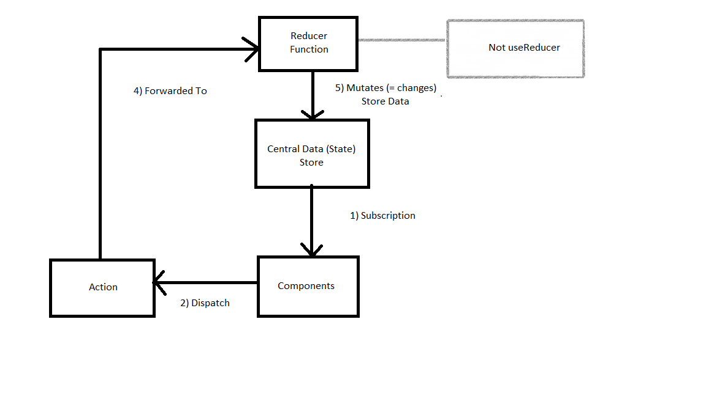

# Redux Notes
- React context or Redux manages app wide state

#### React context disadvantages
- Complex setup management for multiple react context. We could face multiple nested JSX
- Performance: React context is usefull for low freaquency changes, but for high frequency it might be not as much efficient.

#### Core redux concepts
- Redux have one central data store into app.
- we don't need to directly maintain this store.



#### Redux with @reduxjs/toolkit

- To install dependencies

```cmd
npm install redux react-redux @reduxjs/toolkit
```

- Create Slice: createSlice method is use to create reducers. It provide us action method also

```js

//counter-slice.js
import {createSlice} from '@redux/toolkit'

const initialCounterState = {counter: 0, showCounter: true};

const counterSlice = createSlice({
	
	name: 'counter',
	initialState: initialCounterState,
	reducers:{
		increment(state){
			// It is safe because createSlice internally create immutable object
			state.counter++;
		},
		decrement(state){
			state.counter--;
		},
		increase(state, action){
			
			state.counter = state.counter+action.payload.amount;
		},
		toggelCounter(state){
			
			state.showCounter = !state.showCounter
			
		}
	}
});

export const counterAction = counterSlice.actions
export default counterSlice;

```

```js

//auth-slice.js
import {createSlice} from '@redux/toolkit'

const initialAuthState = {isLogin: false};

const authSlice = createSlice({
	
	name: 'auth',
	initialState: initialAuthState,
	reducers:{
		setLogin(state){
			// It is safe because createSlice internally create immutable object
			state.isLogin=true;
		},
		setLogout(state){
			state.isLogin=false;
		}
	}
});

export const authAction = authSlice.actions
export default authSlice;

```


- Configure Store into src/store/index.js (You can choose as you want)

```js

import { configureStore} from '@redux/toolkit'
import counterSlice from './counter-slice'
import authSlice from './auth-slice'


const store = configureStore({
	//reducer: counterSlice.reducer 
	reducer: {counter: counterSlice.reducer, auth: authSlice.reducer} // For multiple reducers
});

export default store;

```

- Setup Redux into the Application

```js
// src/index.js

import {Provider} from 'react-redux'
import store from 'store/index'
---
---
---

root.render(
	<Provider store={store}>
  <Router>
    <App />
  </Router>
  </Provider>
);

```

- Now we need to use counter into some counter component

```js

//component/Counter.js

//useSelector is used to subscribe the data
//useDispatcher is used to dispatch the data to reducer function

import {useSelector} from 'react-redux';
import {useDispatch} from 'react-redux';
import {counterActions} form 'store/counter-slice';
import {authActions} form 'store/auth-slice';

const Counter = (props) => {
	
	const counterState = useSelector(state => state.counter.counter);
	
    // If need to use authSlice

    const authLoginState = useSelector(state => state.auth.isLogin);

	const dispatch = useDispatch();
	
	const increamentCounterHandler = () => {
		
		
		//dispatch({type:'increament'});
		dispatch(counterActions.increament());
		
	}
	
	const increaseCounterHandler = () => {
		
		
		//dispatch({type:'increase', amount: 10});
		dispatch(counterActions.increase({amount: 10})); //Internally create object by redux toolkit look like {type:SOME_UDI_BY_REDUX, payload: any_value_passed_into_method}
		
	}

    const authSetLogin = () => {

        dispatch(authActions.setLogin())
    }
	
    const authSetLogout = () => {

        dispatch(authActions.setLogout())
    }

	return <>
	{counterState}
    {authLoginState}
	</>
}

export default Counter;

```
