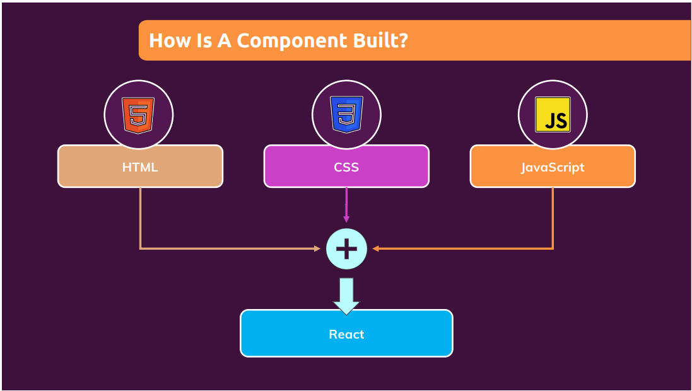
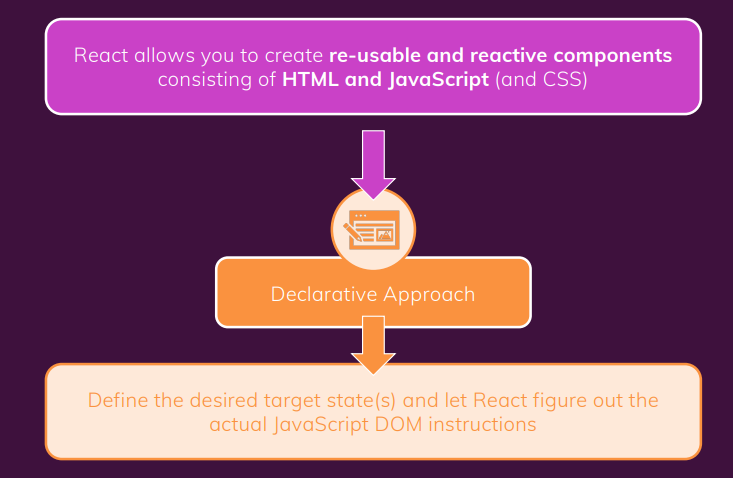

# Module introduction

- React is JS  library for building user interface.
- HTML, CSS & JS are about building user interfaces as well.
- React makes bulding complex, interactive and reactive user interfaces simpler.
- React is all about 'Component'. Because all user interfaces in the end are made up of components.

## Why components?

- Reusibility
- Seperation of concern

## How is a component build?

- React allows you to create re-usable and reactive components consisting of HTML and Javascript and CSS

- For building component, we user Declarative approach.
- Declarative approach is, Define the desired target state(s) and let React figure out the actual JavaScript DOM instructions

- React automatically watch the updates of code.

