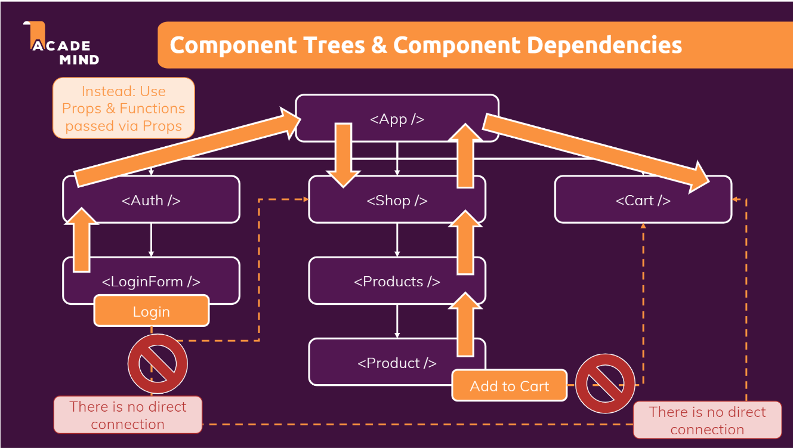
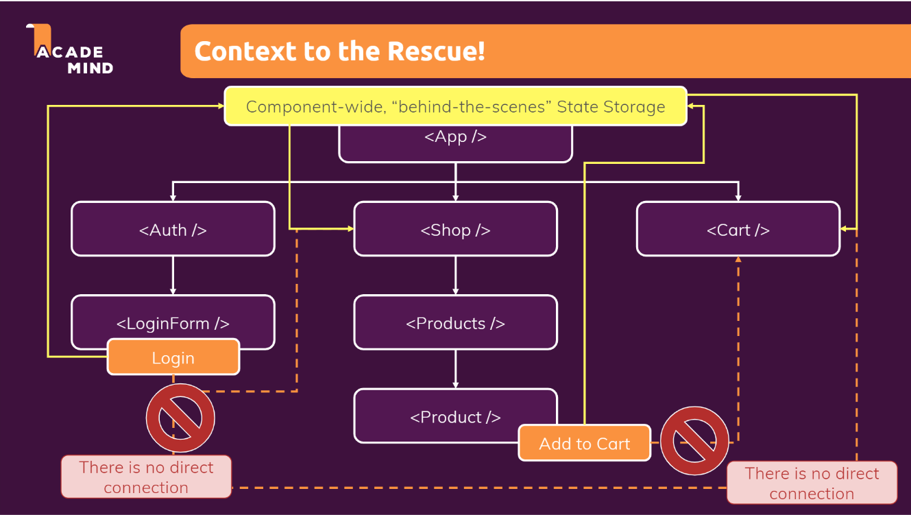

# Introducing React Context (Context API) (v-121)

- [Git Repo](https://github.com/pervez8ktt/06-usereducer-starting-project)
- [Tutorial Git Repo](https://github.com/pervez8ktt/react-complete-guide-code-1/tree/10-side-effects-reducers-context-api)

- It is used where long prop chain made.

- It is used to trigger direct action without using component-wide prop chain

# Using react Context API (v-122)

- 