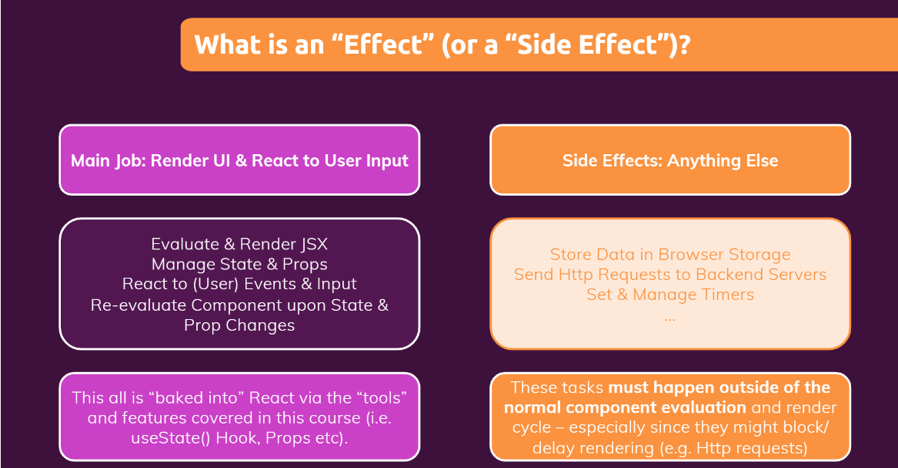
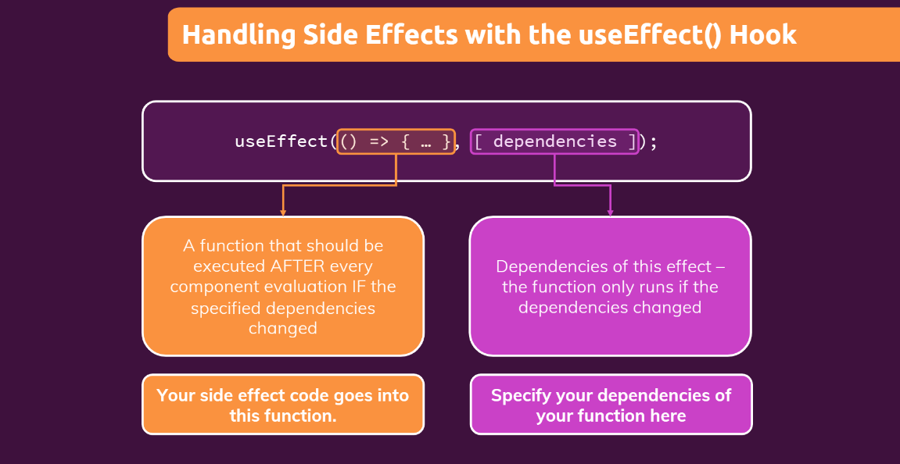

# What are *Side Effects* & Introducing *useEffect* (v-110)




**useEffect** manages other things, which is not used to react the screen like:

- call http reaquest
- Manage timmer
- Save data into local storage

**useEffect** takes two arguments



# Using the useEffect() Hook (v-111)

[App.js](https://github.com/pervez8ktt/react-complete-guide-code-1/blob/10-side-effects-reducers-context-api/code/02-using-the-useeffect-hook/src/App.js)

```js

import React, { useState, useEffect } from 'react';

import Login from './components/Login/Login';
import Home from './components/Home/Home';
import MainHeader from './components/MainHeader/MainHeader';

function App() {
  const [isLoggedIn, setIsLoggedIn] = useState(false);

  useEffect(() => {
    const storedUserLoggedInInformation = localStorage.getItem('isLoggedIn');

    if (storedUserLoggedInInformation === '1') {
      setIsLoggedIn(true);
    }
  }, []);

  const loginHandler = (email, password) => {
    // We should of course check email and password
    // But it's just a dummy/ demo anyways
    localStorage.setItem('isLoggedIn', '1');
    setIsLoggedIn(true);
  };

  const logoutHandler = () => {
    localStorage.removeItem('isLoggedIn');
    setIsLoggedIn(false);
  };

  return (
    <React.Fragment>
      <MainHeader isAuthenticated={isLoggedIn} onLogout={logoutHandler} />
      <main>
        {!isLoggedIn && <Login onLogin={loginHandler} />}
        {isLoggedIn && <Home onLogout={logoutHandler} />}
      </main>
    </React.Fragment>
  );
}

export default App;

```

The above code demostrate the simple login feature. For manage the login state we used '*local storage*'.

```js
localStorage.setItem('isLoggedIn', '1');
```

here we set isLoggedIn into localStorage.

Now as we know whenever we change any state, the whole component re-run.

So if we put 

```js
localStorage.setItem('isLoggedIn', '1');
```

code outside the **useEffect**, It will result the infinit loop.

Here **useEffect** run only once because we used empty dependency, and will never change.

If we make any change on dependency, **useEffect** will run again.

# useEffect & Dependencies (v-112)

As we learned above, useEffect hook will not run again, till depencies not changed. useEffect takes two arguments

- useEffect function
- array of dependencies

```js

useEffect(()=>{
    setValid(enteredEmail.includes('@') & enteredPassword.trim().length>6);

},[enteredEmail, enteredPassword])


```

into above example, we provided enteredEmail and enteredPassword as dependencies. So that whenever these variables changes, useEffect also run again

# Using the useEffect clean up function (v-114)

As we can see in above example, **useEffect** function calls on every key stroke and check form validity. If we want's to run setVAlid function after stop typing, we can do it with the help of clean up function.
    
- Clean up function runs automatically before next useEffect call
- useEffect hook returns it's clean up function

```js

useEffect(()=>{

    const timeoutHandler = setTimeout(()=>{
        setValid(enteredEmail.includes('@') & enteredPassword.trim().length>6);
    },500);

    //Clean up function

    return ()=>{

        console.info("Clean up called")
        clearTimeout(timeoutHandler)

    }

},[enteredEmail, enteredPassword])

```

# useEffect Summary (v-115)