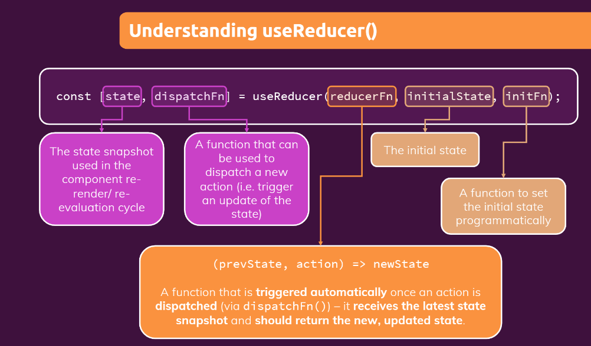

# Using useReducer() Hook (v-117)

- Why we use **userReducer**?

- [Git Repo](https://github.com/pervez8ktt/06-usereducer-starting-project)





 - need to import useReducer

#### [Login.js]()

 ```js
 import React, { useState, useEffect, useReducer } from 'react';
 ```

 