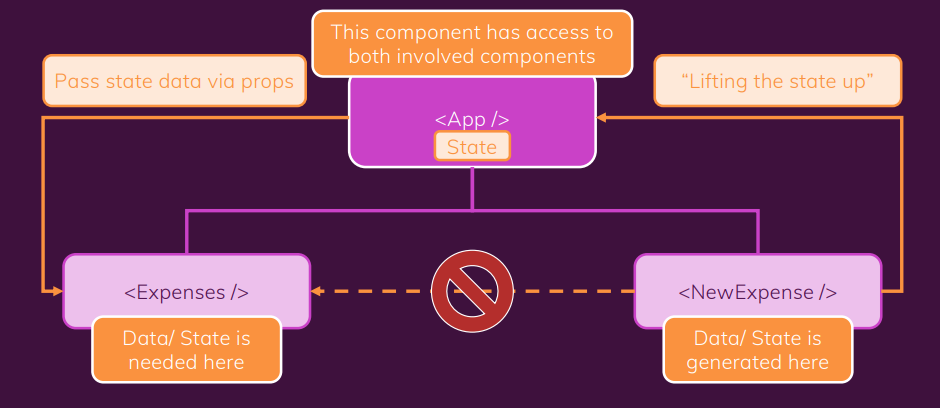

# Updating state that depends on the previous state (v-55)

[Slide](images/states_slides_section_4.pdf)

```js

set UserInput((prevState)=>{
    return {/*New State*/}
})

```
# Adding two way Binding(v-57)

For this we use state. we will resend back to input element.

```js
<input type='text' value={enteredValue} onChange={titleChangedHandler}/>
```

# Child to parent Communication (Bottom - to - up)(v-58)

For this, create a new const or handler into the parent component, and pass it into the child as props.
We can it in any levels.

```js

const submitNewExpense = (expenseData) => {
    console.log(expenseData);
}

return <div>
    <NewExpense onSubmit={submitNewExpense}> </NewExpense>
</div>

```

# Lifting the state up(v-59)



For this, take the value from <NewExpenses/> component, and pass it to <Expenses/> component